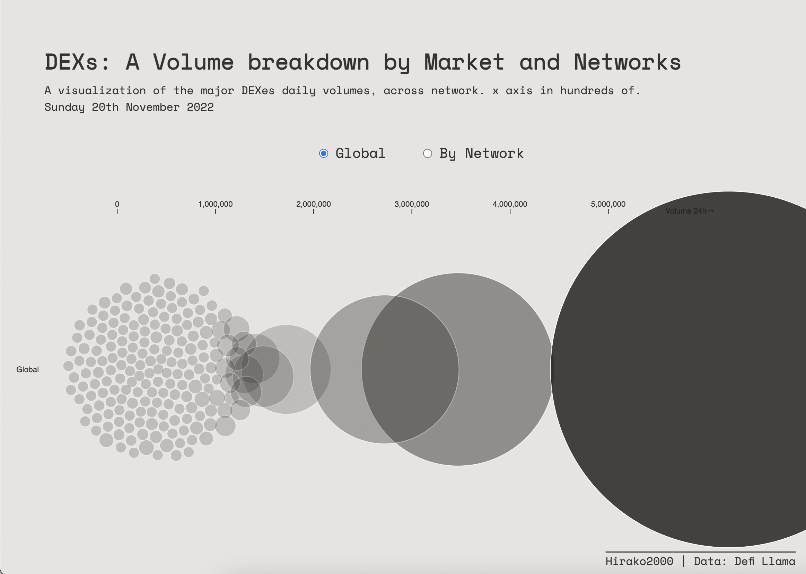

 

  <h3 align="center">DEXes Volumes across Networks </h3>
  <a href="https://dexes-viz-20-22.surge.sh">
    <h5 align="center">Live Demo</h3>
  </a>
  

  

    --- 
     
    <a href="#about"><strong>About »</strong></a>
  

  
Table of Contents

  <ol>
    <li>
      <a href="#about">About</a>
      <ul>
        <li><a href="#built-with">Built With</a></li>
      </ul>
    </li>
    <li>
      <a href="#getting-started">Getting Started</a>
      <ul>
        <li><a href="#prerequisites">Prerequisites</a></li>
        <li><a href="#dev">Dev</a></li>
        <li><a href="#deploy">Deploy</a></li>
      </ul>
    </li>

  </ol>

# About

Visualisation of DEXes Daily volumes

## Built With

- JavaScript
- D3.js 

# Getting Started

## Prerequisites

- Web Browser
- Web Server  

## Dev

Serve root `index.html` file

## Deploy

;;;

(<a href="#readme-top">back to top</a>)

